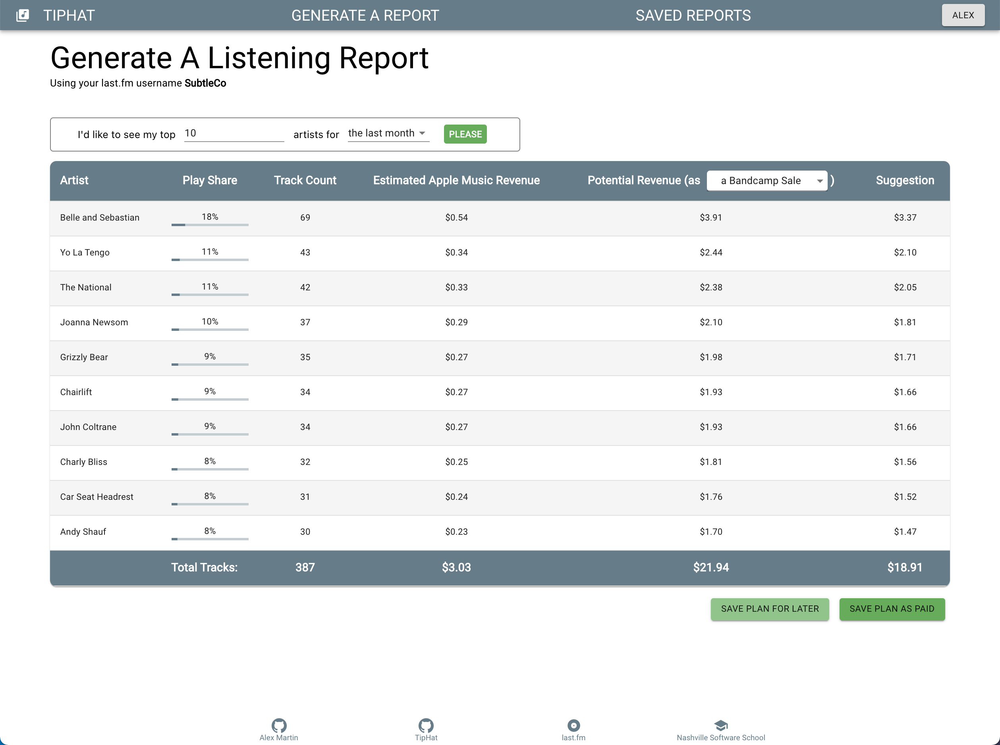

# TipHat
## Description
TipHat is a web application aimed at encouraging users to rethink how they value music in the streaming age.

The app allows users to generate an artist-based listening report based on their [last.fm](https://www.last.fm) account. This listening history is then crossed reference with the user's music streaming service to generate an estimated amount of revenue each artist has received from the streaming service per the user's listening habits. In other words, how much has the listener earned for the artist? Each report also includes a comparison to how much the artist potentially could have made, has the user purchased the music (as a CD, LP, or bandcamp purchase). The user is then presented with the difference between the streaming revenue and the potential sale revenue, encouraging the user to perhaps make a purchase directly from the artist, or simply make a donation.

This project was bootstrapped with [Create React App](https://github.com/facebook/create-react-app).

[Project Proposal](https://docs.google.com/document/d/1EtZOk1N7-cCZp2r7FOEaqC4dct6iXuSoPNPQ7CjbT4A)

### Features
___
#### Authorized users can:

* Generate dynamic reports based on artist count and listening period
* Alter the "potential revenue" base pay (CD, LP, bandcamp, "champion of music")
* Save a report as a donation plan, either as "paid" or "save for later"
* View a list of all plans, saved or unsaved
* View a saved plan, or mark it as unpaid
* View, edit, or delete an unsaved plan, or mark it as paid
* Set a default streaming service
* Set a default value of music (CD, LP, bandcamp, champion of music)

### Background

As the music industry has nearly standardized around streaming, the modern independent recording artist has come to rely on touring and merchandise sales to support their careers. More than half of people that use a music streaming service have opted not to pay for them, and even when they do, the revenue forwarded to the creators is measly at best. There was a time when we, the audience, carefully considered what listened to, if for no other reason than the personal cost of purchasing a record. COVID-19 has done nothing but wreck the touring industry, arguably the ultimate way to earn a paycheck as an artist in early 2020. 

It is my belief that most patrons of musical streaming services are unaware of the direly minimal payouts that artists receive in exchange for their meticulous, soul-bearing work. I hope this app can help remedy that.

## Visual Sample

## Installation

### Requirements

[json-server](https://www.npmjs.com/package/json-server)

### Instructions for Use
1. Clone or fork this repository to your machine
2. Run a server in the root directory of the project that serves index.html
3. Make a copy of the `.env.local.example` file in the root directory and remove the .example extension.
4. Acquire an API key for [last.fm](https://www.last.fm/api) and insert in into your `.env.local` file
5. Make a copy of the database.json.example file in the api directory and remove the .example extension.
6. Using [json-server](https://www.npmjs.com/package/json-server), serve `bakerydb.json` from the `api/` directory. Don't use the `-w` watch flag, as this application makes multiple posts requests at once.
7. Run the `npm install` shell command in the root directory
8. Run the `npm start` shell command in the root directory

## Support

* Please fill out an issue ticket if you run into any major issues or bugs that should be addressed.
* Those with access to the Nashville Software School slack can reach me at `@amart`

#### Future features could include:
* Adding a chart to demonstrate the different payouts of various streaming services vs physical sales revenue
* Adding an accordion menu when the user clicks on their name in the navbar to route to the user settings or logout
* Adding a link to the artist's store in the report table
* Adding an image of each artist to the report table
---
---

## Contributing

The more the merrier! Please feel free to fork this repository and create a pull request with any changes or improvements you can think of.

## Author & Acknowledgements

Built by [Alex Martin](https://github.com/SubtleCo)

One and a half trillion thanks to my mentor [Jisie David](https://github.com/jisie) who helped me realize I was overreacting to React.

## License

Open source, baby.
